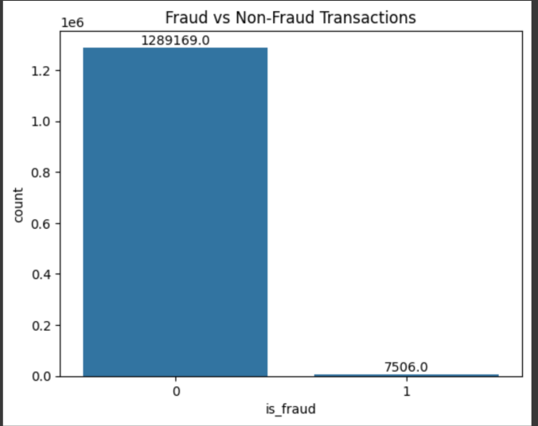
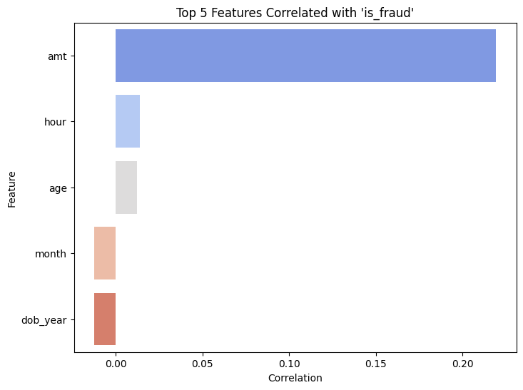
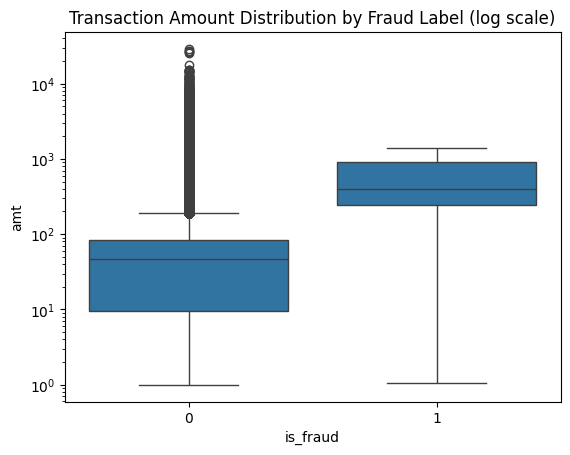
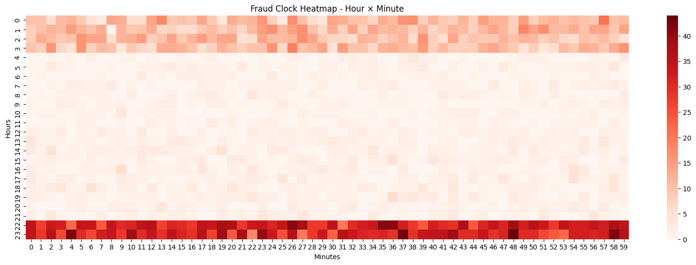
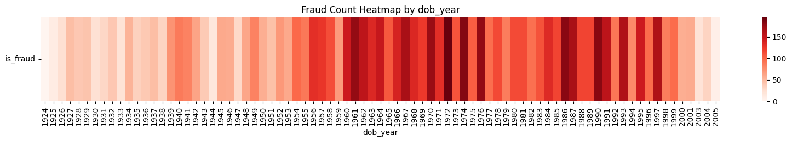
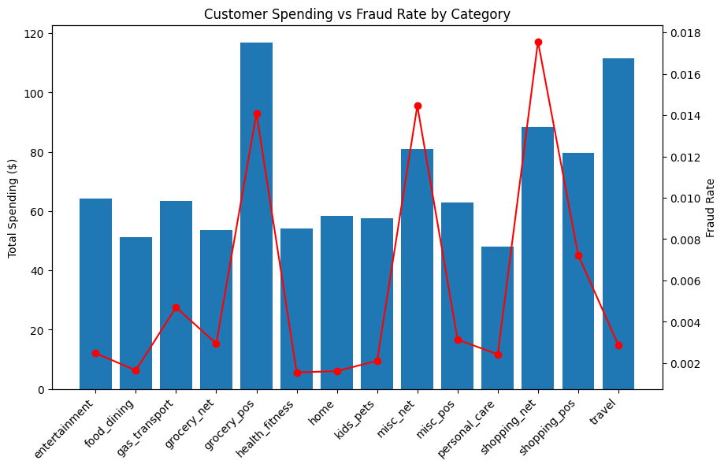
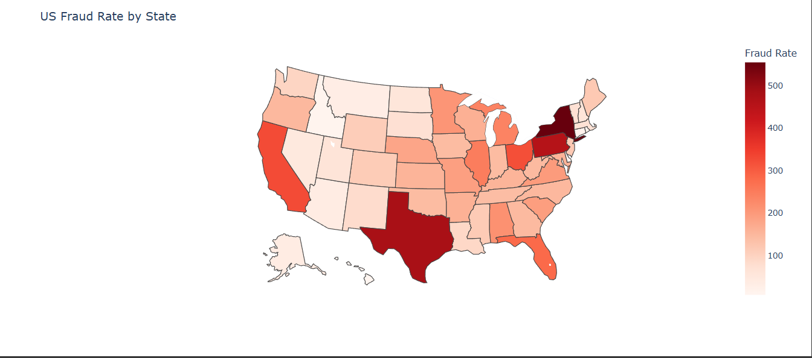

# Credit Card Fraud Detection

## Introduction
This project aims to detect fraudulent credit card transactions in a highly imbalanced dataset.
Dataset taken from: [Kaggle](https://www.kaggle.com/datasets/kartik2112/fraud-detection).

Key objectives:
- Build a preprocessing and feature engineering pipeline.  
- Address the class imbalance problem.  
- Compare multiple machine learning models (Logistic Regression, Decision Tree, Random Forest, XGBoost, LightGBM).  
- Evaluate models using metrics suitable for imbalanced data (ROC-AUC, PR-AUC).  

## Dataset Overview
The project utilizes the **Credit Card Transactions Fraud Detection Dataset** from Kaggle, providing transaction-level details.

* **Data volume**: The training set contains **1,296,675 rows**, while the test set includes **554,795 rows**.
* **Features**: Each record consists of **22 columns**, covering:
    * **Temporal**: Transaction time, date of birth.
    * **Demographics**: Gender, age, job, state, and ZIP code[cite: 9].
    * **Transaction details**: Merchant, category, and amount (`amt`).
    * **Geographical**: Latitude and longitude of both customer and merchant.
* **Class Imbalance**: The dataset is extremely skewed, with only **0.57887%** of records labeled as fraudulent (approximately 7,506 cases in the training set).

## Exploratory Data Analysis (EDA)
Key insights derived from the analysis of the dataset:

* **Feature correlation**: Among numerical features, the transaction **amount (`amt`)** shows the strongest correlation with fraud, followed by the **hour of transaction** and **customer age**. However, all linear correlations remain weak ($<0.25$), suggesting that simple linear models may not suffice.

* **Transaction amount**: Fraudulent transactions generally involve higher monetary values. While legitimate transactions cluster around smaller amounts, fraud is more concentrated in the **mid-to-high ranges**.

* **Temporal patterns**: Fraudulent activities are far more likely to occur **at night**. This strong temporal pattern suggests attackers exploit off-peak hours when monitoring might be perceived as weaker.

* **Demographics**: Customers born between the **1960s and 1980s** appear more frequently in fraud cases, indicating a specific demographic vulnerability.

* **Category analysis**: High spending volumes are seen in `grocery_pos`, `shopping_net`, and `travel`. However, the highest fraud rates ($>1.4\%$) are found in `grocery_pos`, `misc_net`, and `shopping_pos`. `shopping_pos` is particularly critical as it combines high volume with the highest fraud rate (approx. 1.8%).

* **Geographic Concentration**: Fraud rates are notably higher in states such as **New York, Pennsylvania, Texas, and California**, likely driven by population density and economic activity.

## Pipeline
- **Preprocessing & feature engineering**  
  - Time features: extracted year, month, day, hour, minute; created `time_of_day` and `time_delta`.  
  - Demographic features: calculated customer age and generational cohorts.  
  - Address features: split street into components, normalized ZIP codes, extracted ZIP-prefix, calculated haversine distance between customer and merchant as `distance_km`.  
  - Occupation: simplified to the primary job label.  
  - Encoding:  
    - High-cardinality → Frequency Encoding.  
    - Low-cardinality → One-Hot Encoding.  
    - Generations → Label Encoding.  

- **Class imbalance handling**  
  - Applied undersampling to reduce majority class size.  
  - Applied SMOTE oversampling to generate synthetic fraud cases.  
  - Hybrid resampling to balance the dataset.  

- **Baseline benchmark**  
  - Logistic Regression (with `class_weight='balanced'`) trained as the baseline model.  

- **Modeling & evaluation**  
  - Models compared: Logistic Regression, Decision Tree, Random Forest, XGBoost, LightGBM.  
  - Metrics: Precision, Recall, F1, ROC-AUC and PR-AUC (preferred over accuracy for imbalanced data).  

## Key results
- Logistic Regression baseline showed moderate but stable performance, indicating the dataframe has enough information for the model to distinguish between non-fraud and fraud.  
- Resampling improved recall and fraud detection ability.  
- Ensemble models (Random Forest, LightGBM, XGBoost) achieved higher ROC-AUC and PR-AUC than Logistic Regression.  

## Comparision table:
| Model          | Precision (0) | Recall (0) | Precision (1) | Recall (1) | ROC-AUC | PR-AUC |
|----------------|---------------|------------|---------------|------------|---------|--------|
| LogisticReg    | 0.999         | 0.931      | 0.021         | 0.701      | 0.894   | 0.155  |
| RandomForest   | 0.999         | 0.999      | 0.720         | 0.817      | 0.993   | 0.837  |
| XGBoost        | 0.999         | 0.999      | 0.81          | 0.81       | 0.997   | 0.873  |
| LightGBM Auto	 |	1.0					 | 0.995      | 0.438         | 0.924      | 0.998	 | 0.888  |
| LightGBM Manual|	1.0	         | 0.998	    | 0.593	        | 0.900	     | 0.998	 | 0.892  |

